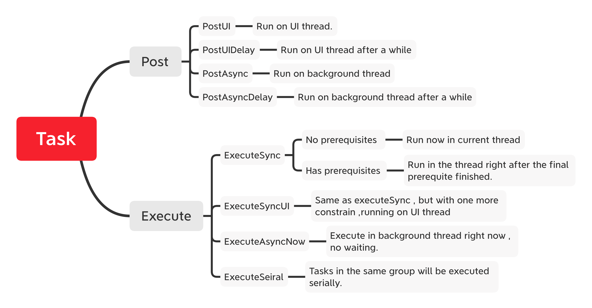
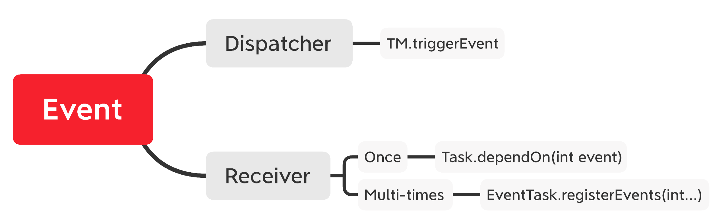
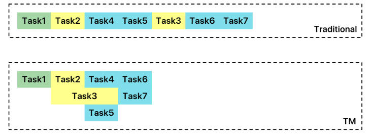
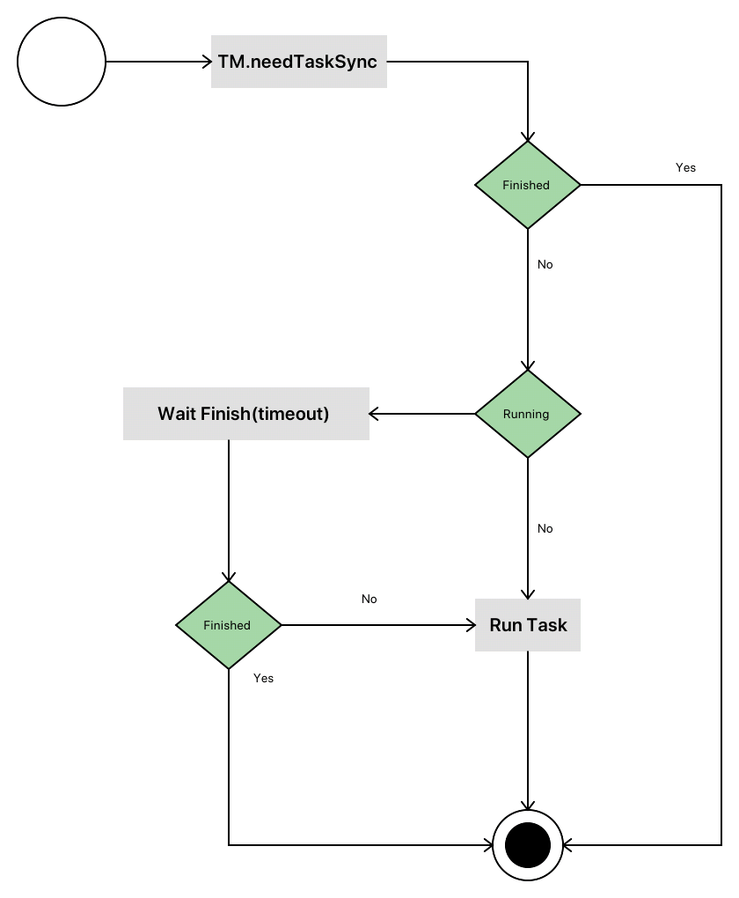

* [中文文档](README-CN.md)
* [Release Note](https://github.com/iqiyi/TaskManager/wiki/ReleaseNote-EN)

##### Task manager is an Android task management tool. It is capable of handling complex task work flow. It's low-coupling, flexible & stable. It supports relation-based tasks. All tasks will be executed in a well-managed order. It can submit tasks with complex relations such as “Or Dependency” or “And Dependency”. Meanwhile, parallel tasks and serial tasks are also supported. 

### Supported Features

```Java
   TM.postAsync(Runnable); // run on background thread
   TM.postAsyncDelay(Runnable);
   TM.postUI(Runnable); // run on UI thread
   TM.postUIDelay(Runnable, int delay);
   TM.postSerial(Runnable  , String groupName);//tasks with same group name , runs in FIFO order.
   TM.cancelTaskByToken(Object);// cancel tasks with same token.

```

#### 1. Task dispatcher: 
* Dispatch task to UI thread or background thread
* Dispatch task to run on background thread in FIFO order (behaves like background thread Handler ).
* Submit a group of tasks, to run in parallell. (ParallellTask)
* To run a task periodically. (TickTask)
* Run task while idle. (Task.enableIdleRun)



#### 2. Event & Data Dispatcher:



 

#### 3. Advantages：

a)  Change serial tasks into parallel tasks by adding task dependencies, so that we can run several tasks in the same time.




 b)  Task execute guarantee: Call “TM.needTaskSync” before your business running. In order to make sure your tasks prerequisites are proper loaded. 




c) Task recursive dependency testing: In debug mode , task recursive test will be executed in order to avoid some wrong relationship been set to tasks.


###  Getting Started

add dependencies in your "build.gradle" file

``` Java
dependencies {
    implementation 'com.iqiyi.taskmanager:taskmanager:1.3.7'
}
```

###  Developer Guide

* [API document wiki](https://github.com/iqiyi/TaskManager/wiki)

###  License

TaskManager is [Apache v2.0 Licensed](https://github.com/iqiyi/Neptune/blob/master/LICENSE).

